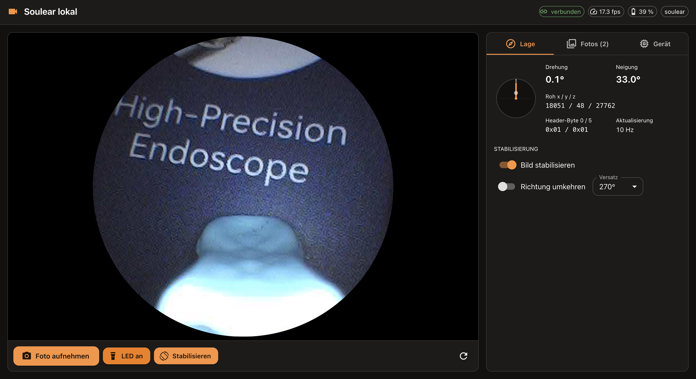

# Soulear lokal – eigene Web-App für die Ohrkamera

Gedacht vor allem als **Makro-/Inspektionskamera für Platinen und
Lötstellen** am Rechner (siehe [Motivation](../README.md#motivation)).



Ersatz für die Hersteller-App: ein **Node.js/TypeScript-Backend**, das im
WLAN der Kamera läuft (Laptop, Raspberry Pi), und ein **React-Frontend** im
Browser. Keine Cloud, kein Lizenz-Report, keine Telemetrie – das Backend
spricht nur mit der Kamera.

```
Kamera ──UDP──▶ Node-Backend (Fastify) ──MJPEG/REST──▶ React im Browser
                 └─ Treiber: mock | replay | soulear
```

## Stand

| Teil | Status |
|---|---|
| Backend: REST-API, MJPEG-Livestream, Fotoablage | fertig |
| Frontend (React + MUI): Livebild, Foto, LED an/aus, Galerie, Hell/Dunkel | fertig |
| Lagesensor: Drehung/Neigung, Rohwerte, Bildstabilisierung (ein/aus) | fertig, Versatz 270° am Gerät ermittelt |
| Treiber `mock` – künstliches Bild, zum Entwickeln ohne Hardware | fertig |
| Treiber `replay` – spielt JPEG-Frames aus einem Mitschnitt ab | fertig |
| Treiber `soulear` – echte Kamera (Livebild, Akku, Geräteinfo, LED, Lagesensor) | **läuft mit echter Kamera** (siehe unten) |
| Simulierte Kamera (`npm run fake-camera`) | fertig |
| pcap-Werkzeug zur Protokoll-Analyse | fertig |

## Schnellstart

Voraussetzung: Node.js ≥ 22.

```bash
cd app
npm install
npm run dev          # Backend :3000 + Vite :5173 -> http://localhost:5173 (echte Kamera)
DRIVER=mock npm run dev   # ohne Hardware, mit künstlichem Bild
```

Produktiv (ein Prozess, Frontend wird vom Backend ausgeliefert):

```bash
npm run build
npm start            # http://127.0.0.1:3000
```

### Konfiguration (Umgebungsvariablen)

| Variable | Standard | Bedeutung |
|---|---|---|
| `DRIVER` | `soulear` | `soulear` (echte Kamera), `mock` oder `replay` |
| `HOST` / `PORT` | `127.0.0.1` / `3000` | Adresse des Backends. `HOST=0.0.0.0`, um vom Handy im selben Netz zuzugreifen. |
| `MEDIA_DIR` | `app/media` | Ablage für Fotos |
| `REPLAY_DIR` | `app/captures/frames` | JPEG-Ordner für `replay` |
| `REPLAY_FPS` | `15` | Bildrate für `replay` |
| `CAMERA_IP` | `192.168.1.1` | Kamera-Adresse für `soulear` |
| `CAMERA_CMD_PORT` / `CAMERA_VIDEO_PORT` | `10005` / `10006` | UDP-Ports der Kamera |
| `STREAM_PORTS` | `22785,22789` | Lokale UDP-Ports für den Bildstrom |
| `LOG_LEVEL` | `info` | Fastify-Loglevel |

## Mit der echten Kamera

1. Kamera einschalten, den **Mac mit dem Kamera-WLAN verbinden** (SSID
   `Soulear-…`, bei anderen Modellen auch `SUEAR…`).
2. Starten:
   ```bash
   npm run dev       # http://localhost:5173
   ```
   macOS fragt evtl., ob Node eingehende Verbindungen annehmen darf →
   erlauben (der Bildstrom kommt per UDP an Port 22785/22789).
3. Im Log sollte stehen: `Kamera: <Hersteller> <Modell> <Firmware>`, danach
   `Erste Bilddaten auf Port …`.

**Getestet (30.09.2026)** mit dem
[Hopefox Ohrenreiniger 1080P HD WiFi](https://www.amazon.de/dp/B0CVX5CJPW)
(App Soulear): Hersteller `YPC`, Modell
`BK7231U-XRH-FBPRO`, Firmware `HKV41B`, SSID `Soulear-…`. Livebild 640×480
mit ~17 fps, Bild kommt auf Port 22785, Startmodus `port` (OpenVideo mit
Port-Nutzlast wird akzeptiert). LED lässt sich nur **an/aus** schalten –
Helligkeitswerte zwischen 1 und 99 haben keine sichtbare Wirkung. Die Anzeige
liest den LED-Zustand nach jedem Umschalten von der Kamera zurück; die
Rohantwort steht einmalig im Log (`LED-Abfrage: Antwort …`).

**Wenn es nicht klappt** (andere Modelle/Firmware):
- *„Kamera antwortet nicht“*: IP prüfen (`route -n get default` im Kamera-WLAN),
  ggf. `CAMERA_IP=…` setzen.
- *Verbunden, aber kein Bild*: Der Treiber versucht OpenVideo erst mit, dann
  ohne Port-Nutzlast. Hilft beides nicht, per Wireshark auf dem Mac ansehen,
  wohin die Kamera sendet (Filter `udp && ip.src==192.168.1.1`), und
  `STREAM_PORTS` anpassen.
- Dann weiter mit einem Mitschnitt der Original-App (unten).

### Protokoll (Kurzfassung)

UDP, little-endian. Jede Nachricht beginnt mit 12 Byte Header
`magic 0xffeeffee | id u16 | type u16 | 1 | errCode | length u16`.

| Port | Typ | Nachricht |
|---|---|---|
| 10005 | 0x01 | GetDeviceInfo → Hersteller, Modell, Firmware, SSID, Akku, Laden |
| 10005 | 0x02 | GetLicense → Seriennummer + Lizenz |
| 10005 | 0x0a | LED setzen `[0x10\|LED, an/aus, 0–100]` / lesen `[LED, 0, 0]` → `[?, an/aus, 0–100]` |
| 10006 | 0x04 | OpenVideo, optional mit Empfangsport (u16) |

Danach sendet die Kamera Chunks: 16 Byte Header (Chunk-Zähler, Frame-Nr.,
letzter Chunk + Gesamtzahl, Lagesensor x/y/z, Auflösung) + bis zu 1456 Byte
JPEG.
Details und Quellen: [server/src/camera/suear-protocol.ts](server/src/camera/suear-protocol.ts).

### Lagesensor & Bildstabilisierung

Jeder Bild-Chunk trägt in Byte 6–11 drei int16-Werte eines
Beschleunigungssensors (x/y/z). Der Treiber glättet sie wie libWifiCamera.so
(10 Werte, ohne Min/Max) und berechnet:
- **Drehung (Roll)** = `atan2(y, z)`, 0–360° – entspricht der Original-App
  (`atan(y/z)` mit Quadrantenkorrektur)
- **Neigung (Pitch)** = `atan2(x, √(y²+z²))`

„Bild stabilisieren“ dreht das Livebild um `Roll + Versatz` und schneidet es
rund zu. Standard-Versatz 270° (am Soulear-Gerät ermittelt; die Original-App
rechnet beim Modell BK7231U-XRH-FBPRO +180° auf einen eigenen Nullpunkt). Dreht das Bild in
die falsche Richtung: „Richtung umkehren“; steht es schief: Versatz ändern.
Die Einstellungen merkt sich der Browser. Gespeicherte Fotos sind **nicht**
gedreht.

Unbekannt sind noch die Header-Bytes 0 und 5 (werden roh angezeigt). Die
Original-App kennt Kamerataste, Videotaste und Zoomtasten – ändert sich eines
der Bytes beim Tastendruck, lässt sich die Taste als Auslöser einbauen.

## Ohne Hardware testen

```bash
npm run fake-camera                  # Terminal 1: simulierte Kamera
CAMERA_IP=127.0.0.1 npm run dev      # Terminal 2
```
Optionen der Simulation: `--loss 0.02` (Paketverlust), `--shuffle`
(Reihenfolge), `--plain-only` (alte Firmware), `--fixed-port 22789`.
Die Simulation beruht auf denselben Annahmen wie der Treiber – sie prüft die
Implementierung, nicht die Annahmen.

## Mitschnitt auswerten (falls nötig)

Mitschnitt der Original-App mit PCAPdroid (siehe
[../docs/README-setup.md](../docs/README-setup.md), Schritt 3), `.pcap` nach
`app/captures/`:

```bash
npm run pcap -- summary      captures/soulear.pcap          # Flows
npm run pcap -- dump         captures/soulear.pcap <flow>   # Header-Analyse
npm run pcap -- hosts        captures/soulear.pcap          # DNS/TLS/HTTP (Cloud-Aufrufe)
npm run pcap -- extract-jpeg captures/soulear.pcap <flow>   # Bilder → DRIVER=replay
```

Hinweis: `extract-jpeg` entfernt nur einen Header pro Datagramm. Beim
Suear-Bildkanal liegen manchmal zwei Chunks in einem Datagramm – dort
entstehen dann defekte Frames. Für diesen Kanal ist der `soulear`-Treiber
selbst das bessere Werkzeug; `extract-jpeg` ist für unbekannte Formate gedacht.

## API

| Methode | Pfad | |
|---|---|---|
| GET | `/api/status` | Verbindung, fps, Akku, LED, Fähigkeiten |
| POST | `/api/connect` | Treiber neu verbinden |
| POST | `/api/disconnect` | Treiber trennen |
| POST | `/api/led` | `{ "level": 0–100 }` (wenn unterstützt) |
| GET | `/api/stream.mjpeg` | Livebild als MJPEG |
| GET | `/api/snapshot.jpg` | letzter Frame |
| GET | `/api/sensors` | Lagesensor als Server-Sent Events (≤ 10/s): `x, y, z, roll, pitch, flags, available` |
| GET | `/api/photos` | Fotoliste |
| POST | `/api/photos` | aktuellen Frame als Foto speichern |
| GET / DELETE | `/api/photos/:name` | Foto laden / löschen |

## Aufbau

```
app/
├── server/src/
│   ├── index.ts            – Fastify-Server, Routen
│   ├── config.ts           – Umgebungsvariablen
│   ├── media.ts            – Fotoablage
│   ├── stream/mjpeg.ts     – MJPEG-Ausgabe (verwirft Frames bei langsamen Clients)
│   ├── camera/             – Treiber: types.ts (Basis), mock, replay, soulear,
│   │                         suear-protocol.ts (Nachrichten, Chunks, Frame-Assembler)
│   └── tools/              – pcap.ts, pcap-analyze.ts (CLI), fake-camera.ts
└── web/src/                – React + MUI
    ├── App.tsx             – Layout (Desktop: volle Fensterhöhe, Seitenleiste mit Tabs; mobil untereinander)
    ├── hooks.ts            – Sensor-Stream, Stabilisierung, gespeicherte Einstellungen
    ├── api.ts, theme.ts
    └── components/         – TopBar, LiveView, Controls, SensorPanel, PhotosPanel, DevicePanel
```

## Einschränkungen

- Das Gerät mit dem Backend muss im **Kamera-WLAN** sein; darin gibt es in
  der Regel kein Internet.
- Auf dem Handy läuft das Backend nicht. Dafür bräuchte es später eine
  Capacitor/React-Native-Hülle mit UDP-Plugin; der Treiber-Code lässt sich
  übernehmen.
- Videoaufnahme fehlt noch (nächster Schritt: Frames als MJPEG/AVI mitschreiben).

## Quellen / Lizenz

Die Protokollkenntnis stammt wesentlich aus **Sean Pesces
[Suear-Web-Viewer](https://github.com/SeanPesce/Suear-Web-Viewer)**
(GPL-2.0), gegengeprüft an `libWifiCamera.so` aus Soulear 1.0.120. Der Code
hier ist eine eigene TypeScript-Umsetzung und steht ebenfalls unter
[GPL-2.0](../LICENSE).

Inoffizielles Projekt ohne Verbindung zum Hersteller; kein Medizinprodukt –
siehe [Hinweise](../README.md#hinweise).
