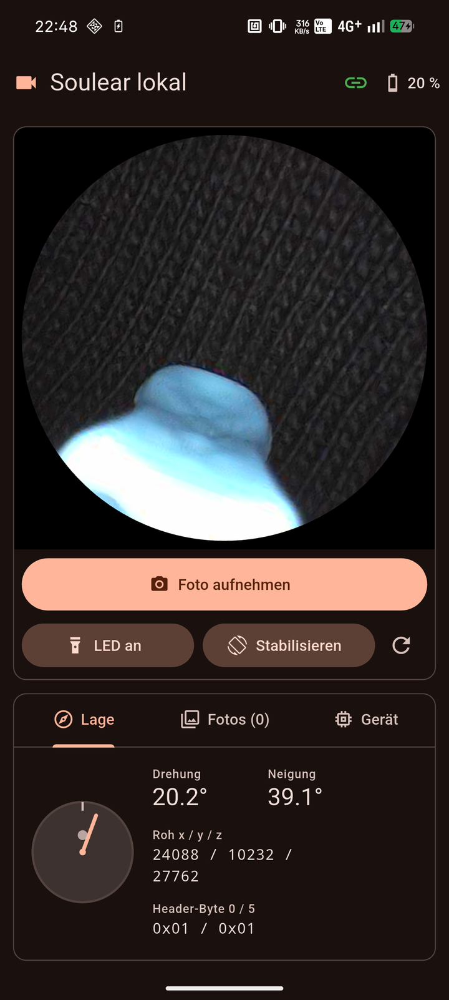

# Soulear lokal – Handy-App (Flutter)

Native App für Android (und iOS) – spricht **direkt** per UDP mit der Kamera,
ohne Backend, ohne Cloud. Gleicher Funktionsumfang wie die Web-App in
[../app](../app/README.md): Livebild, Foto, LED an/aus, Akku, Lagesensor mit
Bildstabilisierung, Galerie, Geräteinfo.



| Teil | Status |
|---|---|
| Protokoll in Dart (`lib/src/protocol.dart`) | fertig, Unit-Tests |
| Kamera-Client (`lib/src/camera_client.dart`) | fertig, gegen die simulierte Kamera getestet |
| Oberfläche Handy/Tablet, hell/dunkel | fertig, Layout-Tests ohne Überläufe |
| Android-Build | APK baut (Release arm64: ~18 MB) |
| Test mit echter Kamera | **läuft** – Nothing Phone (2a), Android 16, mit Kamera `BK7231U-XRH-FBPRO`: Livebild, LED, Stabilisierung, Sensorwerte |
| iOS | Code und Rechte vorbereitet, Build braucht Xcode |

## Installieren (Android)

Voraussetzung: Flutter SDK (getestet mit 3.47) und Android SDK; Handy mit
aktiviertem USB-Debugging per USB verbunden.

```bash
cd flutter_app
flutter build apk --release --split-per-abi --target-platform android-arm64
adb install build/app/outputs/flutter-apk/app-arm64-v8a-release.apk
```

Oder mit angeschlossenem Handy direkt: `flutter run --release`.

Die Release-APK ist mit dem lokalen Debug-Schlüssel signiert – für das eigene
Handy ausreichend, nicht für den Play Store.

## Benutzen

1. Kamera einschalten, **Handy mit dem WLAN der Kamera verbinden**
   (`Soulear-…`). Android meldet „kein Internet“ – verbunden bleiben.
2. App öffnen – sie verbindet sich automatisch mit `192.168.1.1`
   (änderbar im Tab „Gerät“).
3. Fotos landen in der App **und** in der Galerie (Album „Soulear lokal“).

**Warum die App sich ans WLAN bindet:** Weil das Kamera-WLAN kein Internet
hat, schickt Android Verbindungen sonst über die mobilen Daten – dann ist die
Kamera nicht erreichbar. `MainActivity.kt` bindet die App deshalb vor dem
Verbinden per `bindProcessToNetwork` an das WLAN (so macht es auch die
Original-App).

## Entwickeln ohne Kamera

```bash
flutter test                                  # Protokoll- und Layout-Tests
(cd ../app && npm run fake-camera)            # simulierte Kamera (Terminal 1)
dart run tool/probe.dart 127.0.0.1 5          # Dart-Client dagegen testen (Terminal 2)
dart run tool/probe.dart                      # … oder gegen die echte Kamera (Mac im Kamera-WLAN)
```

`tool/probe.dart` verbindet, zählt Bilder, zeigt Sensorwerte und prüft die
LED – dasselbe, was die App tut, nur ohne Oberfläche.

## Aufbau

```
lib/
├── main.dart                 – App, Theme (hell/dunkel nach System)
├── src/
│   ├── protocol.dart         – Nachrichten, Chunks, Frame-Assembler, Sensor-Glättung (reines Dart)
│   ├── camera_client.dart    – UDP-Client (dart:io): Verbindung, OpenVideo, Watchdog, LED, Status
│   └── app_controller.dart   – Zustand, Einstellungen, Fotos, WLAN-Bindung
└── ui/
    ├── home_page.dart        – Layout (breit: Seitenleiste; Handy: untereinander), Bedienleiste
    ├── live_view.dart        – Livebild, Stabilisierung
    ├── sensor_tab.dart       – Lage, Rohwerte, Einstellungen Stabilisierung
    ├── photos_tab.dart       – Galerie, Vollbild mit Zoom
    └── device_tab.dart       – Geräteinfo, Kamera-IP
android/app/src/main/kotlin/…/MainActivity.kt – WLAN-Bindung
test/                         – protocol_test.dart, layout_test.dart
tool/probe.dart               – Kommandozeilen-Test des Clients
tool/make_icon.py             – zeichnet das App-Icon (Stift, flach) → assets/icon/
assets/icon/                  – Icon-Quellen; `dart run flutter_launcher_icons` erzeugt alle Größen
```

Lizenz: GPL-2.0, siehe [../LICENSE](../LICENSE).
